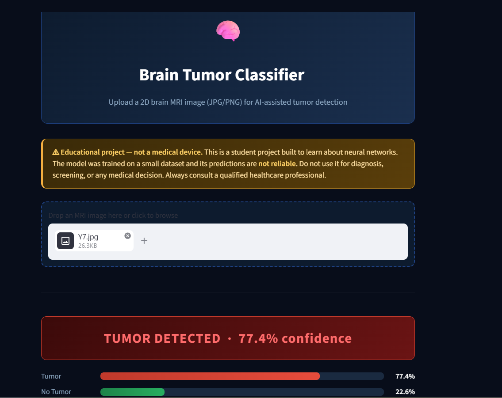

# Brain Tumor Classifier

A deep learning project that classifies brain MRI scans as **tumor** or **no tumor** using a fine-tuned ResNet-18 model. Includes a full training pipeline and an interactive web app built with Streamlit.

> ⚠ **Educational project — not a medical device.** This is a student project built to learn about neural networks. The model was trained on a small dataset and its predictions are **not reliable**. Do not use it for diagnosis, screening, or any medical decision. Always consult a qualified healthcare professional.

---

## Live demo

Try it in your browser: **https://brain-tumor-classifier-arpkufykr5fkq4w6azzwal.streamlit.app/**



---

## What it does

Upload a brain MRI image and the app tells you whether a tumor is detected — with a confidence percentage and color-coded result.

---

## Project structure

```
├── data/
│   ├── yes/              # MRI images with tumor
│   └── no/               # MRI images without tumor
│
├── data_loader/
│   └── dataset.py        # Dataset class + data augmentation + train/val/test split
│
├── model/
│   └── architecture.py   # ResNet-18 with a custom final layer for binary classification
│
├── training/
│   └── trainer.py        # Training loop (forward pass, backprop, validation)
│
├── evaluation/
│   └── evaluate.py       # Test-set evaluation, confusion matrix, training curves
│
├── outputs/              # Saved model weights + generated plots
│   └── brain_tumor_model.pth   # Trained weights (tracked so the live app can load them)
│
├── config.py             # All hyperparameters and paths in one place
├── main.py               # Run this to train the model
└── streamlit_app.py      # Run this to launch the web app
```

---

## Run locally

The easiest way to use the app is the [live demo](#live-demo) above. The steps below are only needed if you want to run it on your own machine or retrain the model.

### 1. Install dependencies

```bash
pip install -r requirements.txt
```

### 2. Launch the web app

```bash
streamlit run streamlit_app.py
```

Streamlit will print a local URL in the terminal — open that in your browser. The trained model (`outputs/brain_tumor_model.pth`) is included in the repo, so no training is required to use the app.

### 3. (Optional) Retrain the model

```bash
python main.py
```

This will:
- Print a dataset summary
- Train for 15 epochs
- Overwrite `outputs/brain_tumor_model.pth`
- Save training curves and a confusion matrix to `outputs/`

---

## Model

- **Architecture:** ResNet-18 pretrained on ImageNet
- **Approach:** Transfer learning — all layers frozen except the final classification layer
- **Input size:** 224 × 224 RGB
- **Output:** 2 classes — Tumor / No Tumor

## Training settings

All settings are in `config.py`:

| Setting | Value |
|---|---|
| Epochs | 15 |
| Learning rate | 0.001 |
| Batch size | 16 |
| Optimizer | Adam |
| Train / Val / Test split | 70% / 15% / 15% |

## Dataset

253 brain MRI images split into two classes:
- **Yes** (tumor): 155 images
- **No** (no tumor): 98 images
